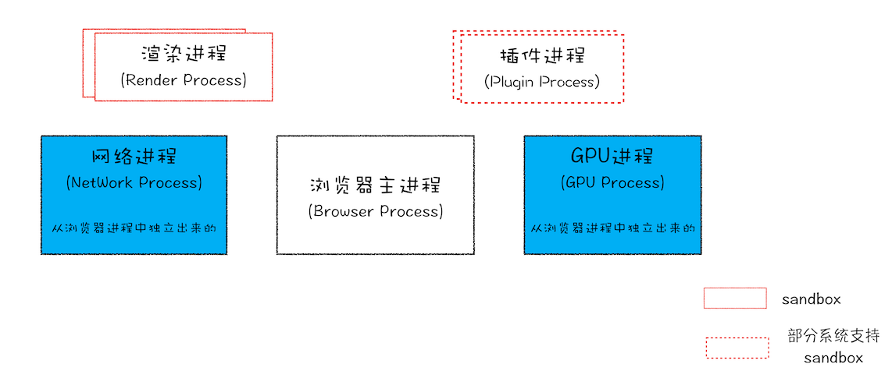
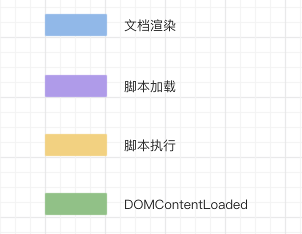
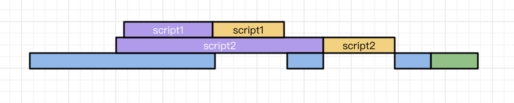
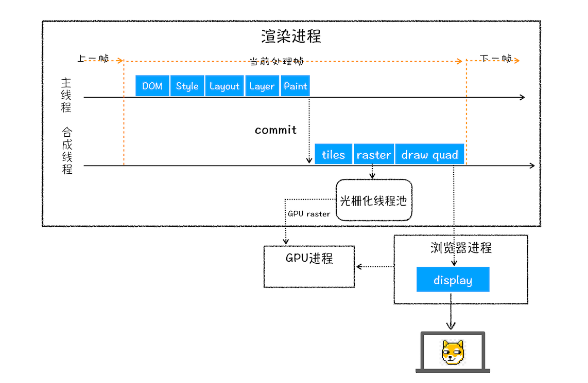
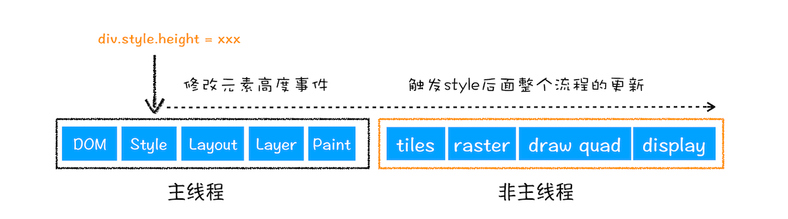
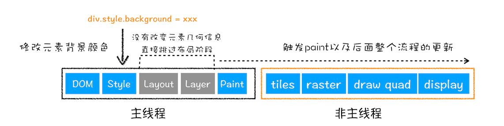
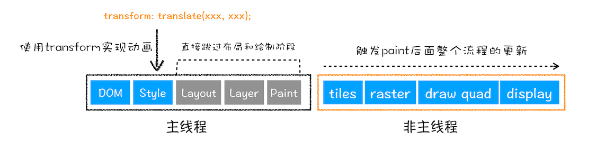

## 前端路由

### hash

- hash 指的是地址中#号以及后面的字符，也称为散列值。hash 也称作锚点，本身是用来做页面跳转定位的
- 散列值是不会随请求发送到服务器端的，所以改变 hash，不会重新加载页面
- 监听 window 的 hashchange 事件，当散列值改变时，可以通过 location.hash 来获取和设置 hash 值
- location.hash 值的变化会直接反应到浏览器地址栏

### 触发 hashchange

- 浏览器地址栏散列值的变化(包括浏览器的`前进`、`后退`)
- 当浏览器地址栏输入 url 带有 hash 且搜索
- 当只改变浏览器地址栏 URL 的哈希部分，这时按下回车
- 通过 a 标签跳转到对应锚点

### history 概述

- window.history: 指向 History 对象，表示当前窗口的浏览历史
- History: 保存了当前窗口访问过的所有页面网址
- 浏览器工具栏的“前进”和“后退”按钮，其实就是对 History 对象进行操作

### history 属性

- length
- state: 堆栈最上层的状态值
- back()
- forward()
- go()
- pushState(state, '', url): 在历史中添加一条记录,不会触发页面刷新
- replaceState(state, '', url)

### popstate

- 仅调用 pushState()或 replaceState(),并不会触发该事件
- 只有用户点击浏览器倒退按钮和前进按钮,back(),forward(),go()才会触发

## 浏览器架构

- 浏览器进程: 主要负责界面显示、用户交互、子进程管理，同时提供存储等功能
- 渲染进程: 核心任务是将 HTML、CSS 和 JavaScript 转换为用户可以与之交互的网页，排版引擎 Blink 和 JavaScript 引擎 V8 都是运行在该进程中，默认情况下，Chrome 会为每个 Tab 标签创建一个渲染进程。运行在沙箱模式下
- GPU 进程: GPU 的使用初衷是为了实现 3D CSS 的效果，只是随后网页、Chrome 的 UI 界面都选择采用 GPU 来绘制
- 网络进程: 主要负责页面的网络资源加载
- 插件进程: 主要是负责插件的运行

## 浏览器渲染

### DOM Tree

HTML 解析成树形的数据结构

- 通过分词器将字节流转换为 Token
  - `Tag Token`: `StartTag`和 `EndTag`
  - `文本 Token`
- 将 Token 解析为 DOM 节点，并将 DOM 节点添加到 DOM 树中(`栈结构`)
  - 如果压入到栈中的是 StartTag Token，HTML 解析器会为该 Token 创建一个 DOM 节点，然后将该节点加入到 DOM 树中，它的父节点就是栈中相邻的那个元素生成的节点
  - 如果分词器解析出来是文本 Token，那么会生成一个文本节点，然后将该节点加入到 DOM 树中，文本 Token 是不需要压入到栈中，它的父节点就是当前栈顶 Token 所对应的 DOM 节点
  - 如果分词器解析出来的是 EndTag 标签，比如是 EndTag div，HTML 解析器会查看 Token 栈顶的元素是否是 StarTag div，如果是，就将 StartTag div 从栈中弹出，表示该 div 元素解析完成
- js 脚本 会阻塞 DOM 生成，而样式文件又会阻塞 js 脚本执行

### defer / async

- defer: 遇到 defer 的脚本，在后台进行下载，不会阻止文档渲染，当页面解析&渲染完毕后。会等到所有的 defer 脚本加载完毕并按照顺序执行，执行完毕后会触发 DOMContentLoaded 事件 
- async: 脚本会在加载完毕后执行。async 脚本的加载不计入 DOMContentLoaded 

### CSS Tree

CSS 解析成树形的数据结构(document.styleSheets)

- 提供给 JavaScript 操作样式表的能力
- 为布局树的合成提供基础的样式信息

### Render Tree

DOM 和 CSSOM 合并后生成 Render Tree

- display:none 的节点不会被加入 Render Tree，而 visibility: hidden 则会
- display:none 会触发 reflow，而 visibility:hidden 只会触发 repaint
- 有些情况下，比如修改了元素的样式，浏览器并不会立刻 reflow 或 repaint 一次，而是会把这样的操作积攒一批，然后做一次 reflow
- 不包含 head 标签、script 标签

### layout

有了 Render Tree，浏览器已经能知道网页中有哪些节点、各个节点的 CSS 定义以及他们的从属关系，从而去计算出每个节点在屏幕中的位置

- 样式计算: 为对应的 DOM 元素选择对应的样式信息
- 计算布局: 计算布局树中每个元素对应的几何位置

### [LayerTree](./css/#层叠上下文)

渲染引擎为特定的节点生成专用的图层

- 拥有层叠上下文属性的元素会被提升为单独的一层
- 需要剪裁(clip)的地方也会被创建为图层

### painting

- 会把一个图层的绘制拆分成很多小的绘制指令,然后再把这些指令按照顺序组成一个待绘制列表
- 绘制列表只是用来记录绘制顺序和绘制指令的列表,当图层的绘制列表准备好之后，主线程会把该绘制列表 commit 给合成线程

### 栅格化 raster

- 合成线程会将图层划分为图块(tile),大小通常是 256x256 或者 512x512
- 栅格化: 是指将 tile 转换为位图.tile 是栅格化执行的最小单位
- 然后合成线程会按照视口附近的 tile 来优先生成位图，实际生成位图的操作是由栅格化来执行的
- 通常，栅格化过程都会使用 GPU 来加速生成，使用 GPU 生成位图的过程叫快速栅格化，或者 GPU 栅格化，生成的位图被保存在 GPU 内存中
- 在首次合成图块的时候使用一个低分辨率的图片。当正常比例的网页内容绘制完成后，再替换掉当前显示的低分辨率内容

### 合成和显示

- 一旦所有图块都被光栅化，合成线程就会生成一个绘制图块的命令`DrawQuad`,然后将该命令提交给浏览器进程
- 浏览器进程根据 DrawQuad 消息生成页面，并显示到显示器上

### 渲染流程总结

### reflow(重排)

- 通过 JavaScript 或者 CSS 修改元素的几何位置属性,那么浏览器会触发重新布局

### repaint(重绘)

- 通过 JavaScript 改变某个元素的背景色、文字颜色、边框颜色等，直接进入 painting,省去了 layout 和 layer tree

### composite

- 渲染引擎将跳过布局和绘制，只执行后续的合成操作
- CSS 的 transform 来实现动画效果，这可以避开重排和重绘阶段，直接在非主线程上执行合成动画操作

## cookie

### Set-Cookie

Set-Cookie: <cookie 名>=<cookie 值>

### Cookie 请求头

Cookie: key=value;

### 过期时间

- Expires=GMT 格式(毫秒)
- Max-Age=秒(优先)

### 安全

- Secure: 只应通过被 HTTPS 协议加密过的请求发送给服务端
- HttpOnly: document.cookie 无法访问

### Domain

指定了哪些主机可以接受 Cookie。如果不指定，默认为 origin，不包含子域名

### Path

指定了主机下的哪些路径可以接受 Cookie

### SameSite

服务器要求某个 cookie 在跨站请求时发送方案

- None: 浏览器会在同站请求、跨站请求下继续发送 cookies，不区分大小写。
- Strict: 浏览器将只在访问相同站点时发送 cookie
- Lax: 在跨站点的情况下,从第三方站点的链接打开和从第三方站点提交 Get 方式的表单这两种方式都会携带 Cookie
