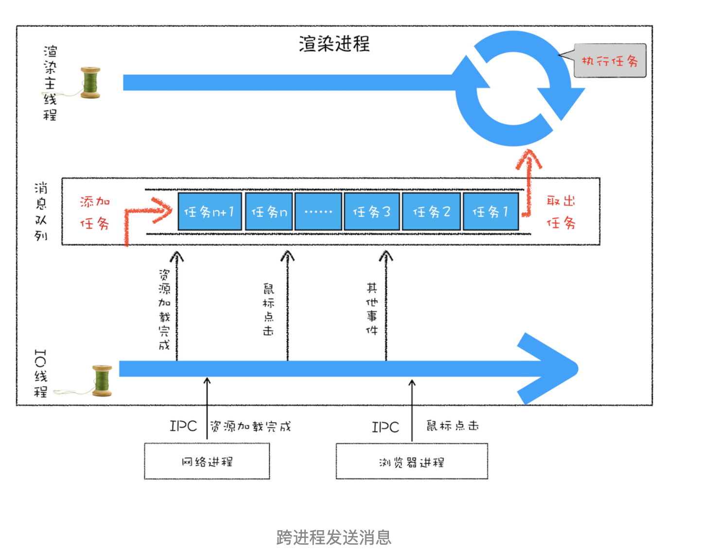

## 消息队列

- 是一种数据结构，可以存放要执行的任务。它符合队列“先进先出”的特点

## setTimeout

- 调用 setTimeout 设置回调函数的时候，渲染进程将会创建一个回调任务，包含了回调函数 showName、当前发起时间、延迟执行时间
- 创建好回调任务之后，再将该任务添加到延迟执行队列中
- 处理完消息队列中的一个任务之后，会根据发起时间和延迟时间计算出到期的任务，然后依次执行这些到期的任务

### 注意点

- 如果当前任务执行时间过久，会影延迟到期定时器任务的执行
- 如果 setTimeout 存在嵌套调用，那么系统会设置最短时间间隔为 4 毫秒
- 未激活的页面，setTimeout 执行最小间隔是 1000 毫秒
- 延时执行时间有最大值(int)
- 调用 setTimeout 来设置回调任务的间隙，消息队列中就有可能被插入很多系统级的任务

## XMLHttpRequest

- 渲染进程会将请求发送给网络进程
- 网络进程负责资源的下载，等网络进程接收到数据之后，就会利用 IPC 来通知渲染进程
- 渲染进程接收到消息之后，会将 xhr 的回调函数封装成任务并添加到消息队列中
- 主线程循环系统执行到该任务的时候，就会根据相关的状态来调用对应的回调函数

## 宏任务

- 渲染事件（如解析 DOM、计算布局、绘制）；
- 用户交互事件（如鼠标点击、滚动页面、放大缩小等）；
- JavaScript 脚本执行事件；
- 网络请求完成、文件读写完成事件
- setTimeout

## 事件循环

- 先从多个消息队列中选出一个最老的任务，这个任务称为 oldestTask
- 然后循环系统记录任务开始执行的时间，并把这个 oldestTask 设置为当前正在执行的任务
- 当任务执行完成之后，删除当前正在执行的任务，并从对应的消息队列中删除掉这个 oldestTask
- 最后统计执行完成的时长等信息

## 微任务

就是一个需要异步执行的函数，执行时机是在主函数执行结束之后、当前宏任务结束之前

### 微任务队列

V8 在创建全局执行上下文的同时,也会在内部创建一个微任务队列,用来存放微任务

### 产生时机

- 使用 MutationObserver 监控某个 DOM 节点，然后再通过 JavaScript 来修改这个节点，或者为这个节点添加、删除部分子节点，当 DOM 节点发生变化时
- 使用 Promise，当调用 Promise.resolve() 或者 Promise.reject() 时

### 何时执行

- 在当前宏任务中的 JavaScript 快执行完成时,会检查全局执行上下文中的微任务队列，然后按照顺序执行队列中的微任务
- 如果在执行微任务的过程中，产生了新的微任务，同样会将该微任务添加到微任务队列中
