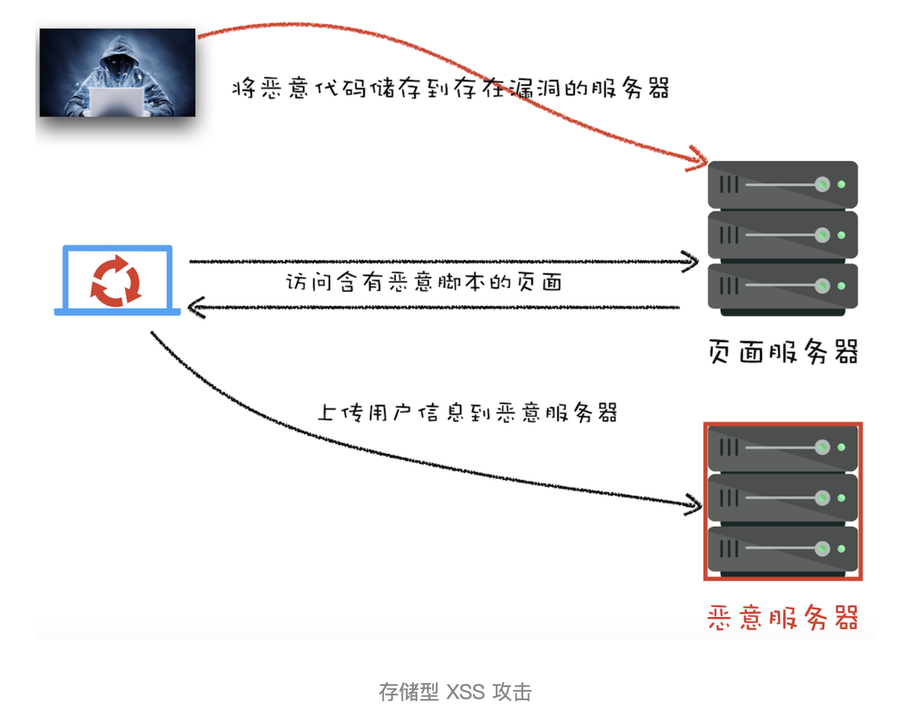

## 同源策略

### 同源

2 个 URL 协议、域名和端口都相同

### 概念

两个不同的源之间若想要相互访问资源或者操作 DOM，那么会有一套基础的安全策略的制约

### 主要表现

- DOM 层面: 限制了来自不同源的 JavaScript 脚本对当前 DOM 对象读和写的操作
- 数据层面: 限制了不同源的站点读取当前站点的 Cookie、IndexDB、LocalStorage 等数据
- 网络层面: 限制了通过 XMLHttpRequest 等方式将站点的数据发送给不同源的站点

## 跨页面通信

### url

### localStorage

### message

```js
window.addEventListener('message', function (event) {
  //event.source: 消息源，消息的发送窗口/iframe
  //event.origin: 消息源的 URI(可能包含协议、域名和端口)，用来验证数据源。
  //event.data: 发送过来的数据
});
```

### postMessage

otherWindow.postMessage(message, targetOrigin, [transfer]);

- otherWindow: 其他窗口的一个引用，比如 iframe 的 contentWindow 属性、执行 window.open 返回的窗口对象、或者是命名过或数值索引的 window.frames
- `message`: 数据
- `targetOrigin`: 指定哪些窗口能接收到消息事件，其值可以是 \*（表示无限制）或者一个 URI。

### iframe

能自由操作 iframe 和父框架的内容(DOM)的前提条件是同域

- `height / width`
- `marginheight`: 顶部和底部的空白边距.`marginwidth`
- `name`: 用于在 js 中引用元素，或者作为链接的目标
- scrolling
  - auto: 在需要的情况下出现滚动条.`默认`
  - yes: 始终显示滚动条(即使不需要) no: 从不显示滚动条(即使需要)
- `src`
- `iframe.contentWindow`: 获取 iframe 的 window 对象
- `iframe.contentDocument`: 获取 iframe 的 document 对象
- `window.parent`: 获取上一级的 window 对象，如果还是 iframe 则是该 iframe 的 window 对象
- `window.top`: 获取最顶级容器的 window 对象，即打开页面的文档
- `window.self`: 返回自身 window 的引用，可以理解为 window===window.self

## CORS(跨域资源共享)

### 场景

- XMLHttpRequest
- Fetch
- Web 字体
- WebGL 贴图
- 使用 drawImage 将 Images/video 画面绘制到 canvas

### 响应首部字段

- Access-Control-Allow-Origin: origin | \*
- Access-Control-Expose-Headers: 允许浏览器访问的头
- Access-Control-Max-Age: seconds
- Access-Control-Allow-Credentials: true
  - 指定了当浏览器的 credentials 设置为 true 时是否允许浏览器读取 response 的内容
  - 当用在对 preflight 预检测请求的响应中时，它指定了实际的请求是否可以使用 credentials
- XMLHTTPRequest 的 withCredentials 代表是否发送身份凭证信息
- Access-Control-Allow-Methods: GET,POST | \*
  - 用于预检请求的响应。指明了实际请求所允许使用的 HTTP 方法
- Access-Control-Allow-Headers: header1,header2
  - 用于预检请求的响应。指明了实际请求中允许携带的首部字段

### 请求首部字段

- Access-Control-Request-Method: GET,POST
  - 预检请求。将实际请求所使用的 HTTP 方法告诉服务器
- Access-Control-Request-Headers: header1,header2
  - 预检请求。将实际请求所携带的首部字段告诉服务器

## XSS

### 概念

往 HTML 文件中或者 DOM 中注入恶意脚本，从而在用户浏览页面时利用注入的恶意脚本对用户实施攻击的一种手段

### 危害

- 窃取 Cookie 信息
- 监听用户行为
- 可以通过修改 DOM 伪造假的登录窗口，用来欺骗用户输入用户名和密码等信息
- 在页面内生成浮窗广告

### 存储型 XSS



### 反射型 XSS

- 恶意 JavaScript 脚本属于用户发送给网站请求中的一部分，随后网站又把恶意 JavaScript 脚本返回给用户

```text
http://localhost:3000/?xss=<script>alert('你被xss攻击了')</script>
```

### 基于 DOM 的 XSS

- 在 Web 资源传输过程或者在用户使用页面的过程中修改 Web 页面的数据
- 网络劫持、WiFi 路由器劫持、本地恶意软件

### 如何阻止

- 服务器对输入脚本进行过滤或转码
- 充分利用 CSP
- 使用 HttpOnly 属性

## CSRF(跨站请求伪造)

### 概念

利用用户的登录状态，并通过第三方的站点来做一些坏事

### 自动 GET

- img
- script

### 自动 POST

原生 form

### 引诱用户点击链接

- 图片
- 邮件

### 如何防止

- Cookie 的 SameSite
- 验证请求的来源站点(origin)
- CSRF Token

## CSP(内容安全策略)

### 核心思想

- 让服务器决定浏览器能够加载哪些资源
- 让服务器决定浏览器是否能够执行内联 JavaScript 代码

### 功能

- 限制加载其他域下的资源文件
- 禁止向第三方域提交数据
- 禁止执行内联脚本和未授权的脚本；
- 提供上报机制，帮助发现 XSS 攻击

### Content-Security-Policy

各种描述 SP 策略指令

- default-src 'self' \*.trusted.com
- img-src
- media-src
- script-src

## Strict-Transport-Security

告诉浏览器只能通过 HTTPS 访问当前资源---Strict-Transport-Security: max-age=seconds
