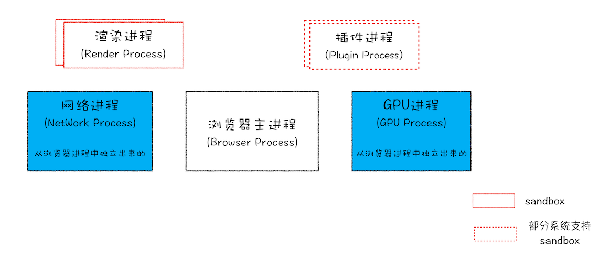
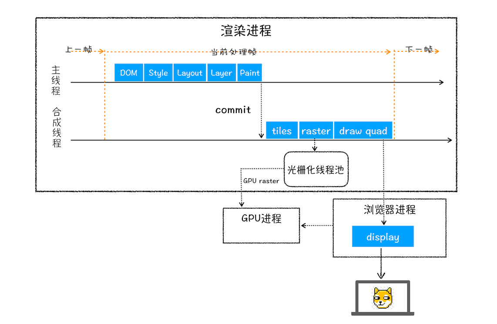
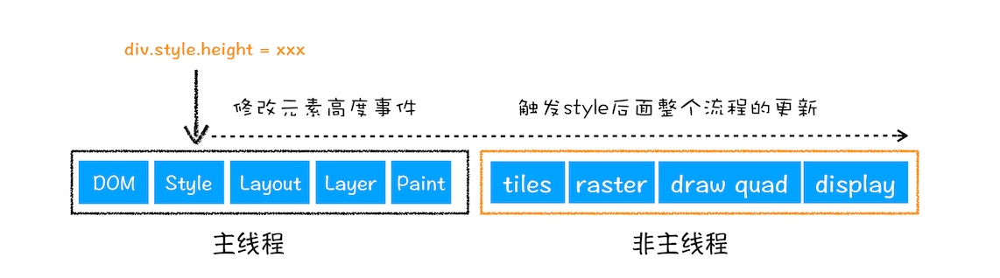
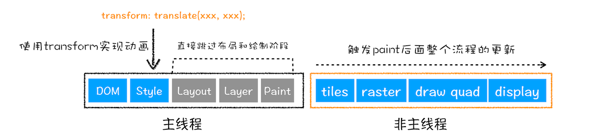

## 浏览器架构

- 浏览器进程: 主要负责界面显示、用户交互、子进程管理,同时提供存储等功能
- 渲染进程: 核心任务是将 HTML、CSS 和 JavaScript 转换为用户可以与之交互的网页,排版引擎 Blink 和 JavaScript 引擎 V8 都是运行在该进程中,默认情况下,Chrome 会为每个 Tab 标签创建一个渲染进程.运行在沙箱模式下
- GPU 进程: GPU 的使用初衷是为了实现 3D CSS 的效果,只是随后网页、Chrome 的 UI 界面都选择采用 GPU 来绘制
- 网络进程: 主要负责页面的网络资源加载
- 插件进程: 主要是负责插件的运行

## 浏览器渲染

### DOM Tree

HTML 解析成树形的数据结构

- 通过分词器将字节流转换为 Token
  - `Tag Token`: `StartTag`和 `EndTag`
  - `文本 Token`
- 将 Token 解析为 DOM 节点,并将 DOM 节点添加到 DOM 树中(`栈结构`)
  - 如果压入到栈中的是 StartTag Token,HTML 解析器会为该 Token 创建一个 DOM 节点,然后将该节点加入到 DOM 树中,它的父节点就是栈中相邻的那个元素生成的节点
  - 如果分词器解析出来是文本 Token,那么会生成一个文本节点,然后将该节点加入到 DOM 树中,文本 Token 是不需要压入到栈中,它的父节点就是当前栈顶 Token 所对应的 DOM 节点
  - 如果分词器解析出来的是 EndTag 标签,比如是 EndTag div,HTML 解析器会查看 Token 栈顶的元素是否是 StarTag div,如果是,就将 StartTag div 从栈中弹出,表示该 div 元素解析完成
- js 脚本 会阻塞 DOM 生成,而样式文件又会阻塞 js 脚本执行

### defer / async

- defer: 遇到 defer 的脚本,在后台进行下载,不会阻止文档渲染,当页面解析&渲染完毕后.会等到所有的 defer 脚本加载完毕并按照顺序执行,执行完毕后会触发 DOMContentLoaded 事件 
- async: 脚本会在加载完毕后执行.async 脚本的加载不计入 DOMContentLoaded 

### CSS Tree

CSS 解析成树形的数据结构(document.styleSheets)

- 提供给 JavaScript 操作样式表的能力
- 为布局树的合成提供基础的样式信息

### Render Tree

DOM 和 CSSOM 合并后生成 Render Tree

- display:none 的节点不会被加入 Render Tree,而 visibility: hidden 则会
- display:none 会触发 reflow,而 visibility:hidden 只会触发 repaint
- 有些情况下,比如修改了元素的样式,浏览器并不会立刻 reflow 或 repaint 一次,而是会把这样的操作积攒一批,然后做一次 reflow
- 不包含 head 标签、script 标签

### layout

有了 Render Tree,浏览器已经能知道网页中有哪些节点、各个节点的 CSS 定义以及他们的从属关系,从而去计算出每个节点在屏幕中的位置

- 样式计算: 为对应的 DOM 元素选择对应的样式信息
- 计算布局: 计算布局树中每个元素对应的几何位置

### [LayerTree](../css/important-concepts#层叠上下文)

渲染引擎为特定的节点生成专用的图层

- 拥有层叠上下文属性的元素会被提升为单独的一层
- 需要剪裁(clip)的地方也会被创建为图层

### painting

- 会把一个图层的绘制拆分成很多小的绘制指令,然后再把这些指令按照顺序组成一个待绘制列表
- 绘制列表只是用来记录绘制顺序和绘制指令的列表,当图层的绘制列表准备好之后,主线程会把该绘制列表 commit 给合成线程

### 栅格化 raster

- 合成线程会将图层划分为图块(tile),大小通常是 256x256 或者 512x512
- 栅格化: 是指将 tile 转换为位图.tile 是栅格化执行的最小单位
- 然后合成线程会按照视口附近的 tile 来优先生成位图,实际生成位图的操作是由栅格化来执行的
- 通常,栅格化过程都会使用 GPU 来加速生成,使用 GPU 生成位图的过程叫快速栅格化,或者 GPU 栅格化,生成的位图被保存在 GPU 内存中
- 在首次合成图块的时候使用一个低分辨率的图片.当正常比例的网页内容绘制完成后,再替换掉当前显示的低分辨率内容

### 合成和显示

- 一旦所有图块都被光栅化,合成线程就会生成一个绘制图块的命令`DrawQuad`,然后将该命令提交给浏览器进程
- 浏览器进程根据 DrawQuad 消息生成页面,并显示到显示器上

### 渲染流程总结

### reflow(重排)

- 通过 JavaScript 或者 CSS 修改元素的几何位置属性,那么浏览器会触发重新布局

### repaint(重绘)

- 通过 JavaScript 改变某个元素的背景色、文字颜色、边框颜色等,直接进入 painting,省去了 layout 和 layer tree

### composite

- 渲染引擎将跳过布局和绘制,只执行后续的合成操作
- CSS 的 transform 来实现动画效果,这可以避开重排和重绘阶段,直接在非主线程上执行合成动画操作
