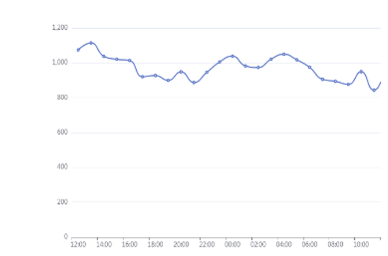

## [PerformanceTiming](https://developer.mozilla.org/zh-CN/docs/Web/API/PerformanceTiming)

## FCP

- First Contentful Paint 首次内容绘制。测量页面从开始加载到页面内容的任何部分在屏幕上完成渲染的时间.文本或者图像或者 svg 元素或者非白色 canvas
- `1.8s 以内`
- `支持抽样`
- web-vitals 下的 `getFCP`

## `LCP`

- Largest Contentful Paint 最大内容绘制。根据页面首次开始加载的时间点来报告可视区域内可见的最大图像或文本块完成渲染的相对时间
- `2.5s 以内`
- `超过15s不采集`
- `支持抽样`
- web-vitals 下的`getLCP`

### 所有记录时间点

- `navigationStart`
- `redirectStart`和`redirectEnd`
- `domainLookupEnd`和`domainLookupStart`
- `connectEnd`和`connectStart`
- `requestStart`和`responseStart`和`responseEnd`
- `domLoading`和`domInteractive`和`domContentLoadedEventEnd`和`domComplete`和`loadEventEnd`

### 重定向

performance.timing.redirectEnd - performance.timing.redirectStart

### DNS 查询

performance.timing.domainLookupEnd - performance.timing.domainLookupStart

### TCP 连接

performance.timing.connectEnd - performance.timing.connectStart

### `请求耗时`

performance.timing.responseStart - performance.timing.requestStart

### `内容传输`

performance.timing.responseEnd - performance.timing.responseStart

### `资源解析`

performance.timing.domLoading - performance.timing.responseEnd

### `dom解析`

performance.timing.domInteractive - performance.timing.domLoading

### `dom渲染及资源加载`

performance.timing.domComplete - performance.timing.domInteractive

## 展示方式

### 耗时分布

### 秒开率

### 具体时间瀑布流

### 异常待定
