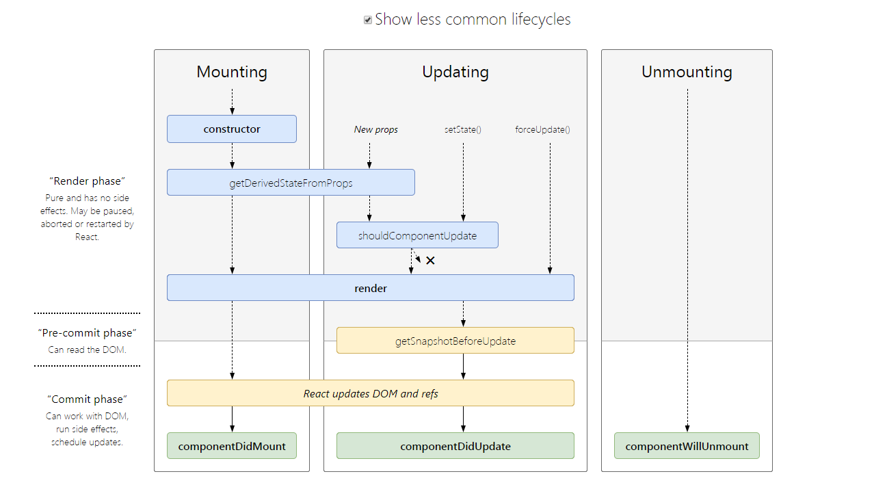

## 参考

- [React 技术揭秘](https://react.iamkasong.com/)

## 前置

### 理念

- 构建快速响应的大型 Web 应用程序
- CPU 瓶颈: 在浏览器每一帧的时间中,预留一些时间给 JS 线程,React 利用这部分时间更新组件
- IO 瓶颈: 将同步的更新变为可中断的异步更新

### 核心思路

- 声明式: 声明式编程的优势在于直观,可以做到一目了然,也便于组合
  - 命令式编程的主要思想是关注计算机执行的步骤
  - 声明式编程的主要思想是告诉计算机应该做什么,但不指定具体要怎么做
  - 函数式编程关注做什么而不是怎么做,函数第一位
- 组件化: 组件化可以降低系统间功能的耦合性,提高功能内部的聚合性
- 通用性: 不会直接操作 DOM 而是抽象为虚拟 DOM,不再局限于 Web 开发

## JSX

- JSX 是一个 JavaScript 的语法扩展,结构类似 XML(DSL)
- JSX 主要用于声明 React 元素,但 React 中并不强制使用 JSX.babel 最终都是转成 React.createElement
- 不引入 JavaScript 本身以外的开发体系.而是希望通过合理的关注点分离保持组件开发的纯粹性
  - 模板不应该是开发过程中的关注点,因为引入了模板语法、模板指令等概念,是一种不佳的实现方案
  - 模板字符串编写的结构会造成多次内部嵌套,使整个结构变得复杂,并且优化代码提示也会变得困难重重

## 15 架构

- Reconcile(协调器): 负责找出变化的组件
- Renderer(渲染器): 负责将变化的组件渲染到页面上

### Reconcile

- 调用函数组件、或 class 组件的 render 方法,将返回的 JSX 转化为虚拟 DOM
- 将虚拟 DOM 和上次更新时的虚拟 DOM 对比
- 通过对比找出本次更新中变化的虚拟 DOM
- 通知 Renderer 将变化的虚拟 DOM 渲染到页面上

### Renderer

- 不同平台有不同的 Renderer
- 在每次更新发生时,Renderer 接到 Reconcile 通知,将变化的组件渲染在当前宿主环境

### 缺点

- 在 Reconcile 中,mount 的组件会调用 mountComponent,update 的组件会调用 updateComponent(递归子组件)
- 由于递归执行,所以更新一旦开始,中途就无法中断.当层级很深时,递归更新时间超过了 16ms,用户交互就会卡顿

## 16 架构

- Scheduler(调度器): 调度任务的优先级,高优任务优先进入 Reconcile
- Reconcile(协调器): 负责找出变化的组件
- Renderer(渲染器): 负责将变化的组件渲染到页面上

### Scheduler

- 需要一种机制,当浏览器有剩余时间时通知我们
- 原生 requestIdleCallback 兼容性、不稳定问题
- 实现上面的 polyfill,还提供了多种调度优先级供任务设置

### Reconcile

- 更新工作从递归变成了可以中断的循环过程.每次循环都会调用 shouldYield 判断当前是否有剩余时间
- Reconcile 与 Renderer 不再是交替工作
- 当 Scheduler 将任务交给 Reconcile 后,Reconcile 会为变化的虚拟 DOM 打上代表增/删/更新的标记
- 只有当所有组件都完成 Reconcile 的工作,才会统一交给 Renderer

### Renderer

Renderer 根据 Reconcile 为虚拟 DOM 打的标记,同步执行对应的 DOM 操作

## Fiber

- 纤程,与进程(Process)、线程(Thread)、协程(Coroutine)同为程序执行过程
- 纤程理解为协程的一种实现.在 JS 中,协程的实现便是 Generator
- React 内部实现的一套状态更新机制.支持任务不同优先级,可中断与恢复,并且恢复后可以复用之前的中间状态
- 每个任务更新单元为 React Element 对应的 Fiber 节点

### 含义

- 架构: 15 的 Reconcile 称为 stack Reconcile。16 的 Reconcile 基于 Fiber 节点实现,被称为 Fiber Reconcile
- 数据结构: 每个 Fiber 节点对应一个 React element,保存了该组件的类型、对应的 DOM 节点等信息
- 工作单元: 每个 Fiber 节点保存了本次更新中该组件改变的状态、要执行的工作

### 结构

```ts
function FiberNode(tag: WorkTag, pendingProps: mixed, key: null | string, mode: TypeOfMode) {
  // 作为静态数据结构的属性
  this.tag = tag; // Fiber对应组件的类型 Function/Class/Host等
  this.key = key; // key属性
  this.elementType = null; // 大部分情况同type,某些情况不同,比如FunctionComponent使用React.memo包裹
  this.type = null; // 对于 FunctionComponent,指函数本身,对于ClassComponent,指class,对于HostComponent,指DOM节点tagName
  this.stateNode = null; // Fiber对应的真实DOM节点

  // 用于连接其他Fiber节点形成Fiber树
  this.return = null; // 指向父级Fiber节点
  this.child = null; // 指向子Fiber节点
  this.sibling = null; // 指向右边第一个兄弟Fiber节点
  this.index = 0;

  this.ref = null;

  // 作为动态的工作单元的属性
  this.pendingProps = pendingProps; // 保存本次更新造成的状态改变相关信息
  this.memoizedProps = null;
  this.updateQueue = null;
  this.memoizedState = null;
  this.dependencies = null;

  this.mode = mode;

  this.effectTag = NoEffect; // 保存本次更新会造成的DOM操作
  this.nextEffect = null;

  this.firstEffect = null;
  this.lastEffect = null;

  // 调度优先级相关
  this.lanes = NoLanes;
  this.childLanes = NoLanes;

  // 指向该fiber在另一次更新时对应的fiber
  this.alternate = null;
}
```

## 双缓存

- 当前屏幕上显示内容对应的 Fiber 树称为 current Fiber 树
- 正在内存中构建的 Fiber 树称为 workInProgress Fiber 树
- 应用的根节点通过使 current 指针在不同 Fiber 树的 rootFiber 间切换来完成 current Fiber 树指向的切换
  - 当 workInProgress Fiber 树构建完成交给 Renderer 渲染在页面上后,应用根节点的 current 指针指向 workInProgress Fiber 树
  - 每次状态更新都会产生新的 workInProgress Fiber 树,通过 current 与 workInProgress 的替换,完成 DOM 更新

### mount

- 首次执行 ReactDOM.render 会创建 fiberRootNode 和 rootFiber
- 其中 fiberRootNode 是整个应用的根节点,rootFiber 是<App\/>所在组件树的根节点
- fiberRootNode 的 current 会指向当前页面上已渲染内容对应 Fiber 树

### render

- 根据组件返回的 JSX 在内存中依次创建 Fiber 节点并连接在一起构建 Fiber 树,被称为 workInProgress Fiber 树
- 构建完 workInProgress Fiber 树在 commit 阶段渲染到页面

### update

- 开启一次新的 render 阶段并构建一棵新的 workInProgress Fiber 树
- workInProgress Fiber 树在 render 阶段完成构建后进入 commit 阶段渲染到页面上

## 生命周期



- `componentDidCatch`(error, errorInfo)
- getDerivedStateFromProps(nextProps, previousState) => newState
- shouldComponentUpdate(nextProps, nextState) => boolean
- getSnapshotBeforeUpdate(previousProps, previousState) => `snapshot`
  - 配合 React 新的异步渲染的机制,在 DOM 更新发生前被调用,返回值将作为 componentDidUpdate 的第三个参数
- componentDidUpdate(previousProps, previousState, `snapshot`)

## 类组件与函数组件

- 在使用方式和最终呈现效果上都是完全一致的
- 类组件面向对象编程(type 为 function),函数组件面向函数式编程(type 为 class)
- 类组件特有的生命周期

## 设计组件

- `展示组件`: 展示组件内部是没有状态管理,完全受制于外部的 props 控制
- 代理组件: 常用于封装常用属性,减少重复代码
- 样式组件: 是一种代理组件,只是又细分了处理样式领域
- 布局组件: 基本设计与样式组件完全一样,主要用于安放其他组件
- `容器组件`: 几乎没有复用性,`拉取数据与组合组件`
- 高阶组件: 参数是组件,返回值为新组件的函数.主要用于: 抽取公共逻辑和渲染劫持
  - 丢失静态函数
  - refs 属性不能透传(React.forwardRef)
