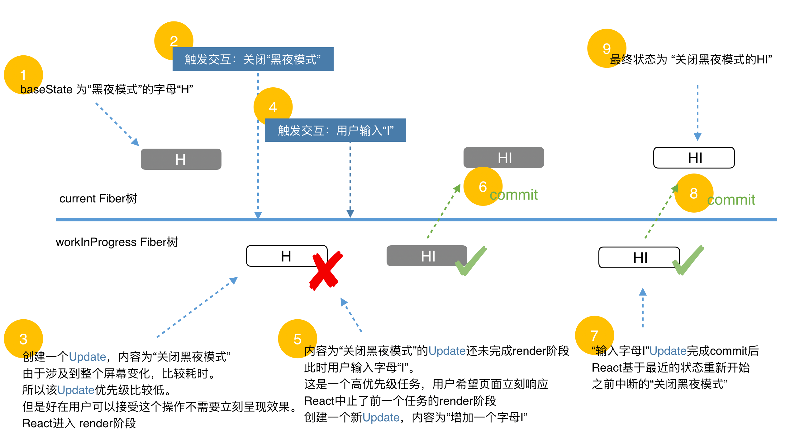

## 关键节点

### 触发状态更新

- ReactDOM.render
- this.setState
- this.forceUpdate
- useState
- useReducer

### 创建 Update 对象

### 从 fiber 到 root

- markUpdateLaneFromFiberToRoot: 从触发状态更新的 fiber 一直向上遍历到 rootFiber,并返回 rootFiber

### 调度更新

- ensureRootIsScheduled

```js
if (newCallbackPriority === SyncLanePriority) {
  // 任务已经过期,需要同步执行render阶段
  newCallbackNode = scheduleSyncCallback(performSyncWorkOnRoot.bind(null, root));
} else {
  // 根据任务优先级异步执行render阶段
  var schedulerPriorityLevel = lanePriorityToSchedulerPriority(newCallbackPriority);
  newCallbackNode = scheduleCallback(schedulerPriorityLevel, performConcurrentWorkOnRoot.bind(null, root));
}
```

### render 阶段

- `performSyncWorkOnRoot`
- `performConcurrentWorkOnRoot`

### commit 阶段

- `commitRoot`

## Update

### 分类

- ReactDOM.render --- HostRoot
- this.setState --- ClassComponent
- this.forceUpdate --- ClassComponent
- useState --- FunctionComponent
- useReducer --- FunctionComponent

### 结构

```js
const update: Update<*> = {
  eventTime,
  lane,
  suspenseConfig,
  tag: UpdateState,
  payload: null,
  callback: null,

  next: null,
};
```

- eventTime:任务时间
- lane:优先级相关字段
- tag:UpdateState | ReplaceState | ForceUpdate | CaptureUpdate
- payload
  - ClassComponent 为 this.setState 的第一个传参
  - HostRoot 为 ReactDOM.render 的第一个传参
- callback:更新的回调函数
- next:与其他 Update 连接形成链表

### 与 Fiber

- Fiber 节点上的多个 Update 会组成链表并被包含在 fiber.updateQueue
- current fiber 保存的 updateQueue 即 current updateQueue
- workInProgress fiber 保存的 updateQueue 即 workInProgress updateQueue

### updateQueue

```js
const queue: UpdateQueue<State> = {
  baseState: fiber.memoizedState,
  firstBaseUpdate: null,
  lastBaseUpdate: null,
  shared: {
    pending: null,
  },
  effects: null,
};
```

- baseState: 本次更新前该 Fiber 节点的 state
- firstBaseUpdate 与 lastBaseUpdate: 本次更新前该 Fiber 节点已保存的 Update
- shared.pending: 触发更新时,产生的 Update 会保存在 shared.pending 中形成单向环状链表
- effects: 数组。保存 update.callback !== null 的 Update

## 优先级



- 生命周期方法: 同步执行。
- 受控的用户输入: 比如输入框内输入文字,同步执行
- 交互事件: 比如动画,高优先级执行
- 其他: 比如数据请求,低优先级执行

### 如何调度

- 会调用 Scheduler 提供的方法 runWithPriority
- 该方法接收一个优先级常量与一个回调函数作为参数.回调函数会以优先级高低为顺序排列在一个定时器中并在合适的时间触发
- 优先级最终会反映到 update.lane 变量上

### 保证 Update 不丢失

- shared.pending 会被同时连接在 workInProgress updateQueue.lastBaseUpdate 与 current updateQueue.lastBaseUpdate
- 当 render 阶段被中断后重新开始时,会基于 current updateQueue 克隆出 workInProgress updateQueue
- 当 commit 阶段完成渲染,由于 workInProgress updateQueue.lastBaseUpdate 中保存了上一次的 Update,所以 workInProgress Fiber 树变成 current Fiber 树后也不会造成 Update 丢失

### 状态依赖连续性

- 当某个 Update 由于优先级低而被跳过时,保存在 baseUpdate 中的不仅是该 Update,还包括链表中该 Update 之后的所有 Update
- 当有 Update 被跳过时,下次更新的 baseState !== 上次更新的 memoizedState
