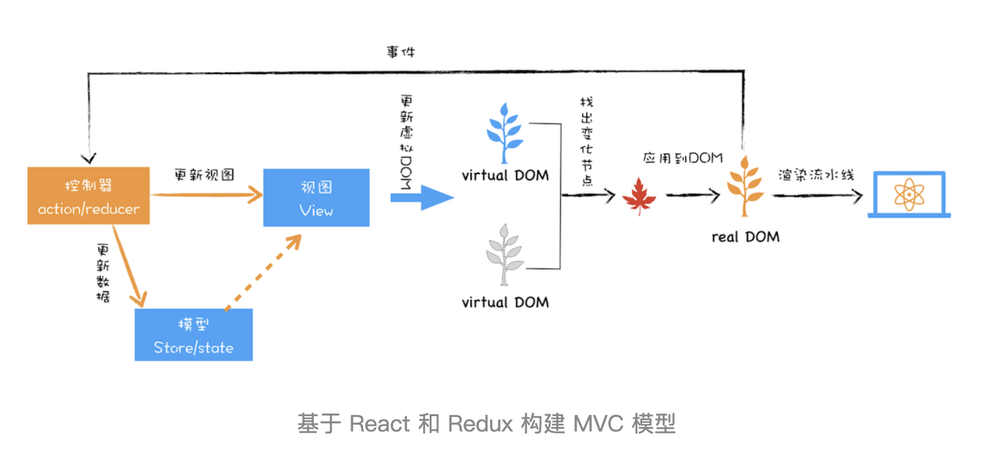

## DOM 缺陷

- 对于复杂页面,执行一次重排或者重绘操作都是非常耗时的,所以需要减少 JavaScript 对 DOM 的操作

## virtualDom

### 解决事情

- 将页面改变的内容应用到虚拟 DOM 上,而不是直接应用到 DOM 上
- 变化被应用到虚拟 DOM 上时,虚拟 DOM 并不急着去渲染页面,而仅仅是调整虚拟 DOM 的内部状态
- 在虚拟 DOM 收集到足够的改变时,再把这些变化一次性应用到真实的 DOM 上

### 创建阶段

- 依据 JSX 和基础数据创建出来虚拟 DOM
- 然后由虚拟 DOM 树创建出真实 DOM 树
- 真实的 DOM 树生成完后,再触发渲染流水线往屏幕输出页面

### 更新阶段

- 如果数据发生了改变,那么就需要根据新的数据创建一个新的虚拟 DOM 树
- 然后 React 比较两棵树,找出变化的地方,并把变化的地方一次性更新到真实的 DOM 树上
- 最后渲染引擎更新渲染流水线,并生成新的页面

## 双缓存角度

- 可以把虚拟 DOM 看成是 DOM 的一个 buffer
- 它会在完成一次完整的操作之后,再把结果应用到 DOM 上
- 这样就能减少一些不必要的更新,同时还能保证 DOM 的稳定输出

## MVC 角度

- 虚拟 DOM 看成是 MVC 的视图部分
- 控制器和模型都是由 Redux 提供
- 控制器监控 DOM 的变化,一旦 DOM 发生变化,控制器便会通知模型,让其更新数据
- 模型数据更新好之后,控制器会通知视图,告诉它模型的数据发生了变化
- 视图接收到更新消息之后,会根据模型所提供的数据来生成新的虚拟 DOM
- 新的虚拟 DOM 生成好之后,就需要与之前的虚拟 DOM 进行比较,找出变化的节点
- 比较出变化的节点之后,React 将变化的虚拟节点应用到 DOM 上,这样就会触发 DOM 节点的更新
- DOM 节点的变化又会触发后续一系列渲染流水线的变化,从而实现页面的更新
