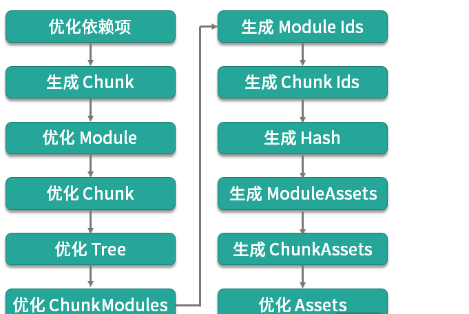

## 参考

- [webpack 官方](https://webpack.js.org/guides/)
- [前端工程化精讲](https://kaiwu.lagou.com/course/courseInfo.htm?courseId=416#/detail/pc?id=4357)

## 术语

- module: 在模块化编程中我们把应用程序分割成的独立功能的代码模块
- chunk: 指模块间按照引用关系组合成的代码块,一个 chunk 中可以包含多个 module
- chunk group: 指通过配置入口点(entry point)区分的块组,一个 chunk group 中可包含一到多个 chunk
- bundling: webpack 打包的过程
- asset/bundle: 打包产物

## SourceMap

### 关键字

- false: 即不开启 source map 功能
- `eval和source-map`: eval 关键字来决定使用 EvalSourceMapDevToolPlugin 或 SourceMapDevToolPlugin 作为 source map 的处理插件
- `module`: 为加载器(Loaders)生成 source map
- `cheap`
  - 当 module 为 false 时,它决定插件 module 参数的最终取值,最终取值与 cheap 相反
  - 它决定插件 `columns` 参数的取值,作用是决定生成的 source map 中是否包含列信息

### 实践

- 开发环境: `eval-cheap-module-source-map`
- 生产环境: `source-map`

## 插件

一个包含 apply 方法的 JavaScript 对象.这个 apply 方法的执行逻辑,通常是注册 Webpack 工作流程中某一生命周期 Hook,并添加对应 Hook 中该插件的实际处理函数

```js
class HelloWorldPlugin {
  apply(compiler) {
    compiler.hooks.run.tap('HelloWorldPlugin', (compilation) => {
      console.log('hello world');
    });
  }
}

module.exports = HelloWorldPlugin;
```

## loader

用来加载处理各种形式的资源,本质上是一个函数, 接受文件作为参数,返回转化后的结构

```js
module.exports = function (source) {
  return `export default ${JSON.stringify(source)}`;
};
```

## 构建流程

### 基本流程

- 本质上都是 webpack.js 中的 Webpack 函数
- 根据配置生成编译器实例 compiler,然后处理参数
- 执行 WebpackOptionsApply().process
- 根据参数加载不同内部插件
- 在有回调函数的情况下,根据是否是 watch 模式来决定要执行 compiler.watch 还是 compiler.run

```js
const webpack = (options, callback) => {
  options = {};
  let compiler = new Compiler(options.context);
  compiler.options = new WebpackOptionsApply().process(options, compiler);
  if (callback) {
    compiler.run(callback);
  }

  return compiler;
};
```

### Compiler.js

- readRecords: 读取[构建记录](https://webpack.js.org/configuration/other-options/#recordspath),用于分包缓存优化,在未设置 recordsPath 时直接返回
- compile 的主要构建过程
  - newCompilationParams: 创建 NormalModule 和 ContextModule 的工厂实例,用于创建后续模块实例
  - newCompilation: 创建编译过程 Compilation 实例,传入上一步的两个工厂实例作为参数
  - compiler.hooks.make.callAsync: 触发 make 的 Hook,执行所有监听 make 的插件
  - compilation.finish: 编译过程实例的 finish 方法,触发相应的 Hook 并报告构建模块的错误和警告
- `emitAssets`: 调用 compilation.getAssets(),将产物内容写入输出文件中
- emitRecords: 写入构建记录,在未设置 recordsPath 时直接返回

### Compilation.js

- addEntry: 从 entry 开始递归添加和构建模块
- seal: 冻结模块,进行一系列优化,以及触发各优化阶段的 Hooks

### 生命周期

Compiler 和 Compilation 都扩展自 Tapable 类,用于实现工作流程中的生命周期划分,以便在不同的生命周期节点上注册和调用插件.其中所暴露出来的生命周期节点称为 Hook

## Compiler Hooks

### 初始化阶段

- environment、afterEnvironment: 在创建完 compiler 实例且执行了配置内定义的插件的 apply 方法后触发
- entryOption、afterPlugins、afterResolvers: 在执行 EntryOptions 插件和其他 Webpack 内置插件,以及解析了 resolver 配置后触发

### 构建过程阶段

- normalModuleFactory、contextModuleFactory: 在两类模块工厂创建后触发
- beforeRun、run、watchRun、beforeCompile、compile、thisCompilation、compilation、make、afterCompile: 在运行构建过程中触发

### 产物生成阶段

- shouldEmit、emit、assetEmitted、afterEmit: 在构建完成后,处理产物的过程中触发
- failed、done: 在达到最终结果状态时触发

## Compilation Hooks

### 构建阶段

- buildModule、rebuildModule、finishRebuildingModule、failedModule、succeedModule: 在构建单个模块时触发
- finishModules: 在所有模块构建完成后触发

### 优化阶段


