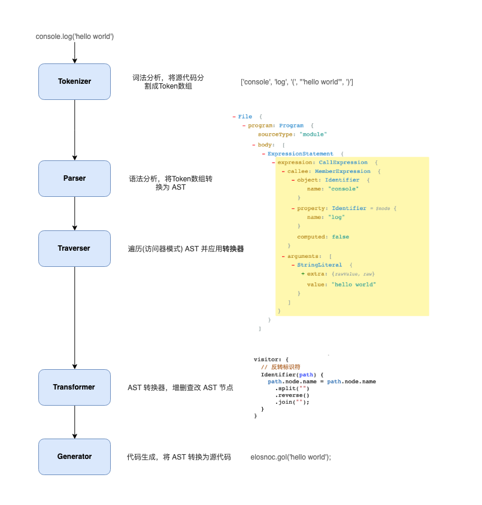

## [参考](https://bobi.ink/2019/10/01/babel/)

## 处理流程



## 架构


### @babel/core

架构中的内核

- 加载和处理配置(config)
- 加载插件
- 调用 Parser 进行语法解析,生成 AST
- 调用 Traverser 遍历 AST,并使用访问者模式应用插件对 AST 进行转换
- 生成代码,包括 SourceMap 转换和源代码生成

### 周边支撑

- Parser(@babel/parser): 将源代码解析为 AST
- Traverser(@babel/traverse): 实现了访问者模式,对 AST 进行遍历,转换插件会通过它获取感兴趣的 AST 节点,对节点继续操作
- Generator(@babel/generator): 将 AST 转换为源代码,支持 SourceMap

### 插件

- @babel/plugin-syntax-\*: @babel/parser 已经支持了很多 JavaScript 语法特性,实际上只是用于开启或者配置 Parser 的某个功能特性
- @babel/plugin-transform-\*: 普通的转换插件
- @babel/plugin-proposal-\*: 还在提议阶段(非正式)的语言特性
- @babel/presets-\*: 插件集合或者分组,主要方便用户对插件进行管理和使用。preset-env,preset-react

### 插件开发辅助

- @babel/template: 某些场景直接操作 AST 太麻烦,所以 Babel 实现了这么一个简单的模板引擎,可以将字符串代码转换为 AST
- @babel/types: AST 节点构造器和断言.插件开发时使用很频繁
- @babel/helper-\*: 一些辅助器,用于辅助插件开发
- @babel/helper: 辅助代码

### 工具

- @babel/node: Node.js CLI, 通过它直接运行需要 Babel 处理的 JavaScript 文件
- @babel/register: Patch NodeJs 的 require 方法，支持导入需要 Babel 处理的 JavaScript 模块
- @babel/cli: CLI 工具

## 访问者模式

转换器会遍历 AST 树,找出自己感兴趣的节点类型,再进行转换操作

### 一般遍历

```js
const babel = require('@babel/core');
const traverse = require('@babel/traverse').default;

const ast = babel.parseSync(code);

let depth = 0;
traverse(ast, {
  enter(path) {
    console.log(`enter ${path.type}(${path.key})`);
    depth++;
  },
  exit(path) {
    depth--;
    console.log(`  exit ${path.type}(${path.key})`);
  },
});
```

### 特定节点遍历

```js
const babel = require('@babel/core');
const traverse = require('@babel/traverse').default;

const ast = babel.parseSync(code);
traverse(ast, {
  // 访问标识符
  Identifier(path) {
    console.log(`enter Identifier`);
  },
  // 访问调用表达式
  CallExpression(path) {
    console.log(`enter CallExpression`);
  },
  // 二元操作符
  BinaryExpression: {
    enter(path) {},
    exit(path) {},
  },
  // 更高级的, 使用同一个方法访问多种类型的节点
  'ExportNamedDeclaration|Flow'(path) {},
});
```

### 节点上下文

```js
export class NodePath<T = Node> {
  constructor(hub: Hub, parent: Node);
  parent: Node;
  hub: Hub;
  contexts: TraversalContext[];
  data: object;
  shouldSkip: boolean;
  shouldStop: boolean;
  removed: boolean;
  state: any;
  opts: object;
  skipKeys: object;
  parentPath: NodePath;
  context: TraversalContext;
  container: object | object[];
  listKey: string; // 如果节点在一个数组中，这个就是节点数组的键
  inList: boolean;
  parentKey: string;
  key: string | number; // 节点所在的键或索引
  node: T;  // 🔴 当前节点
  scope: Scope; // 🔴当前节点所在的作用域
  type: T extends undefined | null ? string | null : string; // 🔴节点类型
  typeAnnotation: object;
}
```

### 副作用处理

- 删除父节点的兄弟节点、删除第一个子节点、新增兄弟节点
- 当这些操作污染了 AST 树后,访问者需要记录这些状态,响应式(Reactive)更新 Path 对象的关联关系,保证正确的遍历顺序,从而获得正确的转译结果

### 作用域处理

- AST 转换的前提是保证程序的正确性
- 在添加和修改引用时,需要确保与现有的所有引用不冲突
- Babel 本身不能检测这类异常
- Scope 属性表示作用域

```ts
interface Scope {
  path: NodePath;
  block: Node; // 所属的词法区块节点, 例如函数节点、条件语句节点
  parentBlock: Node; // 所属的父级词法区块节点
  parent: Scope; // ⚛️指向父作用域
  bindings: { [name: string]: Binding }; // ⚛️ 该作用域下面的所有绑定(即该作用域创建的标识符)
}
```

- 在词法区块(block)中,新建变量、函数、类、函数参数等创建的标识符,都属于这个区块作用域. 这些标识符也称为绑定(Binding),而对这些绑定的使用称为引用(Reference)

```ts
interface Binding {
  identifier: t.Identifier;
  scope: Scope;
  path: NodePath;
  kind: 'var' | 'let' | 'const' | 'module';
  referenced: boolean;
  references: number; // 被引用的数量
  referencePaths: NodePath[]; // ⚛️获取所有应用该标识符的节点路径
  constant: boolean; // 是否是常量
  constantViolations: NodePath[];
}
```
