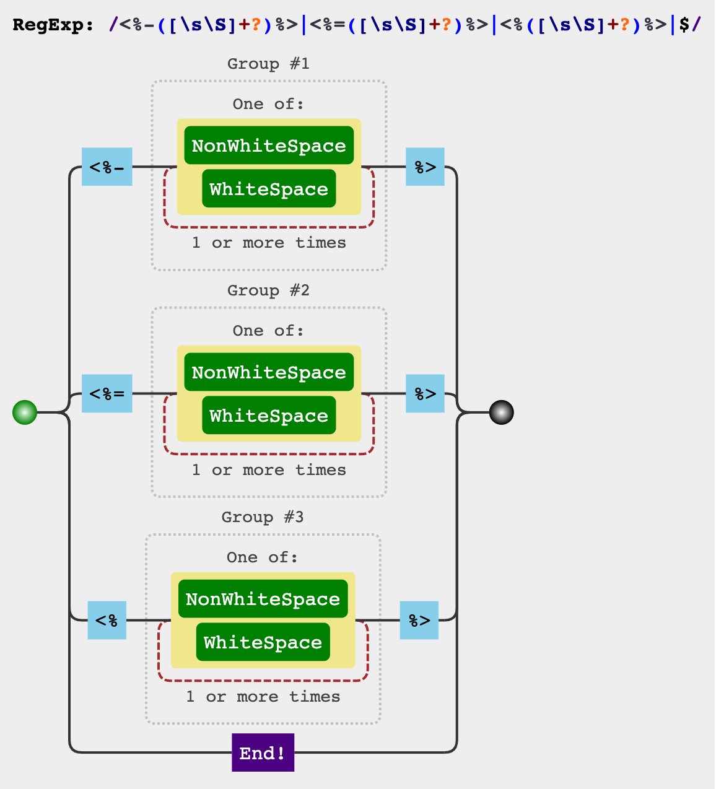

## [underscorejs](https://github.com/jashkenas/underscore/blob/master/modules/template.js)

## templateSettings

```js
export default _.templateSettings = {
  evaluate: /<%([\s\S]+?)%>/g,
  interpolate: /<%=([\s\S]+?)%>/g,
  escape: /<%-([\s\S]+?)%>/g,
};
```

## matcher



## render

### interpolate

```js
_.template('hello: <%= name %>');
```

```js
function anonymous(obj, _) {
  var __t,
    __p = '',
    __j = Array.prototype.join,
    print = function () {
      __p += __j.call(arguments, '');
    };
  with (obj || {}) {
    __p += '"hello: ' + ((__t = name) == null ? '' : __t) + '"';
  }
  return __p;
}
```

### escape

```js
_.template('hello: <%- name %>');
```

```js
function anonymous(obj, _) {
  var __t,
    __p = '',
    __j = Array.prototype.join,
    print = function () {
      __p += __j.call(arguments, '');
    };
  with (obj || {}) {
    __p += 'hello: ' + ((__t = name) == null ? '' : _.escape(__t)) + '';
  }
  return __p;
}
```

### evaluate

```js
_.template("<% print('Hello ' + epithet); %>");
```

```js
function anonymous(obj, _) {
  var __t,
    __p = '',
    __j = Array.prototype.join,
    print = function () {
      __p += __j.call(arguments, '');
    };
  with (obj || {}) {
    __p += '';
    print('Hello ' + epithet);
    __p += '';
  }
  return __p;
}
```

### 显式 data

```js
_.template("Using 'with': <%= data.answer %>", { variable: 'data' });
```

```js
function anonymous(data, _) {
  var __t,
    __p = '',
    __j = Array.prototype.join,
    print = function () {
      __p += __j.call(arguments, '');
    };
  __p += "Using 'with': " + ((__t = data.answer) == null ? '' : __t) + '';
  return __p;
}
```
