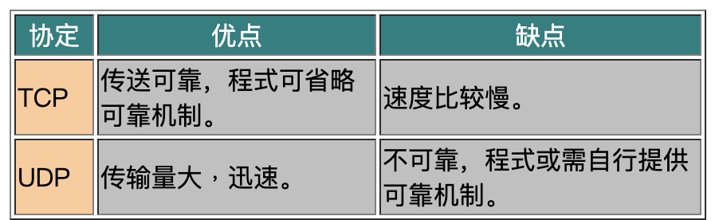
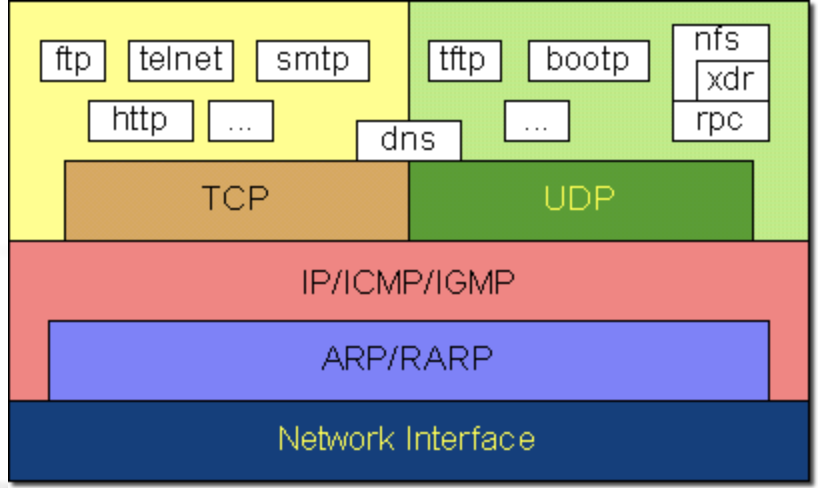

### udp

- 优点
  - 头长度还不到 TCP 头的一半，所以在同样大小的包里，UDP 包携带的净数据比 TCP 包多一些
  - 没有 Seq 号和 Ack 号等概念，无法维持一个连接，省去了建立连接的负担。在 DNS 查询优势明显
- 缺点
  - 拿到应用层的数据之后，直接打上 UDP 头就交给下一层了（IP 层重组）---分片机制存在弱点，会成为黑客的攻击目标
  - 没有重传机制，所以丢包由应用层来处理

