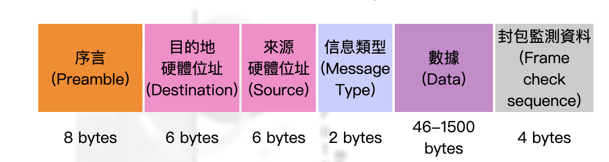
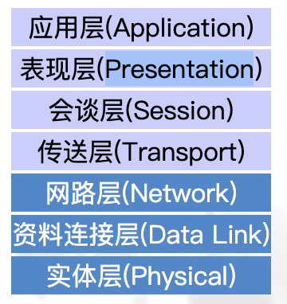

### 基本概念

- **局域网**(LAN)、**广域网**(WAN)
- **封包(Packet)**---是能够在网路上面进行传输的最小资讯单位。一个封包包含有`发送端节点地址`﹑`接收端节点地址`﹑和这`两个节点之间需要传送的数据`
- **网路物理形态**---网路上面的各个节点之间在物理上面的布置

  - `总线状(bus)`
  - `环状(ring)`
  - `星状(star)`---中央是一个 hub

- 网路逻辑形态---讲述的是信息如何在网路中行走

  - 判定这个封包的格式
  - 判定有多少数据需要携带
  - 判定使用什么方法来追踪在网路传输的封包

- `Mbps(bits)`和`MBps(byte)`
- 中继器（Repeater） ---放大传输信号
- 集线器(hub)---将信号放大，再向所有 port 广播一遍---`物理层`
- 网桥（bridge）---一个硬体或软体用来连接不同的网路区段(segment)的设备---`数据链路层`
  - 它们仅属于同一网路之内的两个区段,只要上层的传输协定是一致的，那 bridge 就能让不同的硬体 segment 沟通
  - **Discovery** ﹐就是 bridge 的任意一端是否有资料到达
  - **Filtering** ﹐接着 bridbe 过滤(filter)资料，并决定是否需要传送到另一端
  - **Forwarding** ﹐然后 bridge 将资料传送(forward)给目的端位址，若使用的格式不一致，则同时进行转换
- 交换机（switch）---多 port 的 bridge ---`数据链路层`
- 路由器（router）---用来将封包从一个网路主机传送到其它网路主机的硬体或软体设备---`网络层`
  - 传输协定本身的沟通，连接各自独立的网路
  - hop---封包从一个 router 传到另一个 router 的过程
  - `封包的逻辑位址(来源跟目的)`
  - `硬体位址(来源和目的)`
- 网关（Gateway）---一扇大门（gate），门里门外是两个不同的网路，有不同的网路协议
  - 路由器可以看作一种 gateway 的特例
  - 网关能在不同协议间移动数据
  - 路由器是在不同网络间移动数据，相当于传统所说的 IP 网关（IP gateway）
- Frame(1518)

### [OSI](http://www.study-area.org/network/network_ip_model.htm)

- **实体层**---在这层里面作出一些机械和电子方面的决定﹐也就是要定义出在终端和网络之间要使用的设备
- **资料连接层**---保证一个无错误的物理上的数据传输
- **网路层**---定义出封包在网路中移动的路由和其处理过程﹐还决定了网路是如何进行管理功能的
- **传送层**---设定节点位址的传达﹐还有错误检测和修正的方法
- **会谈层**---定义了如何连接和挂断连接﹐和在网路上面的数据如何交换
- **表现层**---定义了数据的语法(syntax)﹑变更﹑和格式。当应用程式的语法和格式都不同的时候﹐这层还将定义了如何翻译这些不同
- **应用层**---定义了应用程式是如何进入 OSI 模式进行传送---表现层是针对特定的主机的 CPU 类型﹐而应用层则针对特定应用程式
