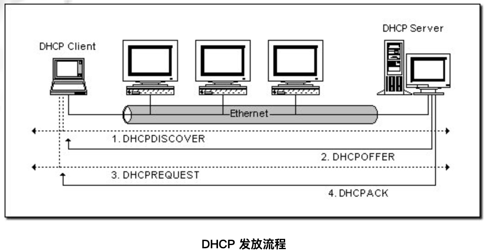

### 概念

- 服务器端---所有的 IP 网路设定资料都由 DHCP 服务器集中管理,并负责处理客户端的 DHCP 要求

- 客户端---使用从服务器分配下来的 IP 环境资料

### 分配形式

- 首先,必须至少有一台 DHCP 工作在网路上面,它会监听网路的 DHCP 请求,并与客户端搓商 TCP/IP 的设定环境
- `Automatic Allocation`: 一旦 DHCP 客户端第一次成功的从 DHCP 服务器端租用到 IP 位址之后,就永远使用这个位址
- `Dynamic Allocation`: 当 DHCP 第一次从 DHCP 服务器端租用到 IP 位址之后,并非永久的使用该位址,只要租约到期,客户端就得释放(release)这个 IP 位址,以给其它工作站使用
- DHCP 除了能动态的设定 IP 位址之外,还可以将一些 IP 保留下来给一些特殊用途的机器使用,它可以按照硬体位址来固定的分配 IP 位址.同时,DHCP 还可以帮客户端指定 router、netmask、DNS Server、WINS Server

### 工作原理

- 寻找 Server: 向网路发出一个`DHCPDISCOVER`封包.封包的来源位址会为 0.0.0.0 ,而目的位址则为 255.255.255.255 ,然后再附上 `Dhcpdiscover` 的信息,向网路进行广播
- 提供 IP 租用位址: 当 DHCP 服务器监听到客户端发出的 `Dhcpdiscover` 广播后,它会从那些还没有租出的位址范围内,选择最前面的的空置 IP ,连同其它 TCP/IP 设定,回应给客户端一个`DHCPOFFER`封包
- 接受 IP 租约: 如果客户端收到网路上多台 DHCP 服务器的回应,只会挑选其中一个 `Dhcpoffer`,并且会向网路发送一个`Dhcprequest`广播封包,告诉所有 DHCP 服务器它将指定接受哪一台服务器提供的 IP 位址
- 租约确认: 当 DHCP 服务器接收到客户端的 `Dhcprequest` 之后,会向客户端发出一个`DHCPACK`回应,以确认 IP 租约的正式生效,也就结束了一个完整的 DHCP 工作过程
