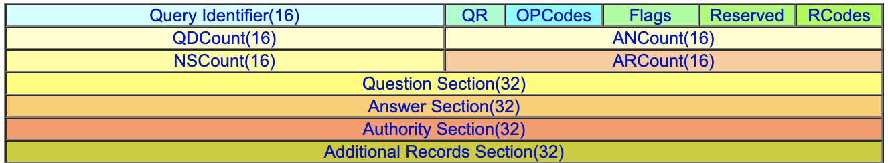
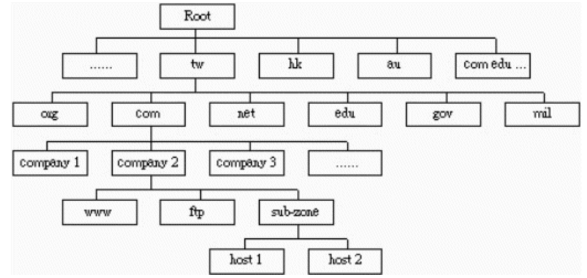

### frame

### 定义

Domain 和 IP 的映射、回答更多关于网路和主机的其它信息。`应用层`

### 域名结构

### 类别名称

| TXT   | 只是一些说明文字﹐可以用来说明主机/网路环境设定。                                                                            |
| ----- | ---------------------------------------------------------------------------------------------------------------------------- |
| NS    | 名称伺服器: 也就是该 zone 指定的授权 DNS 伺服器名称                                                                          |
| MX    | 邮件伺服器: 负责经由 DNS 查询进行邮件传递的邮件伺服器                                                                        |
| A     | `用来对应主机名称和其 IP 位址`                                                                                               |
| HINFO | 和 TXT 差不多﹐是回答“Host Information”查询用的。                                                                            |
| CNAME | `是一个“别名”记录`,可以给 A 记录使用另外一个(或多个)名称让外面查询。CNAME 可以对应一个 A 记录﹐但不鼓励对应另一个 CNAME 记录 |
| AAAA  | 和 A 记录一样﹐只不过对应的是 IP v6 格式                                                                                     |
| PTR   | 与 A 记录的功能相反，它能从 IP 地址解析到域名                                                                                |

### 查找过程

### 命令

- `nslookup`
