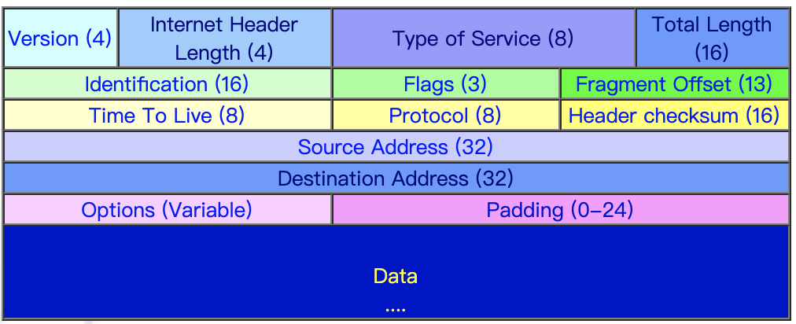

### 封包

### 主要功能

- 定义资料在网际网路中传输的基本单位
- 定义网际网路的定址方式
- 负责网路存取层和传送层之间的资料传递
- 决定资料传送的路由路径
- 执行资料的分解和重组

### 地址类型

- 如果是以“0”开头的﹐这是一个**A Class**的 IP
- 如果是以“10”开头的﹐这是一个**B Class**的 IP
- 如果是以“110”为开头的﹐则属于**C Class**的 IP

### Net_ID/Host_ID

- A Class 的 IP 使用最前面一组数字来做 Net ID﹐其余三组做 Host ID
- B Class 的 IP 使用前面两组数字来做 Net ID﹐另两组做 Host ID
- C Class 的 IP 使用前面三组数字来做 Net ID﹐剩下的一组做 Host ID
- Net_ID 为 127(01111111)---给本机回路测试使用﹐不可以被运用于实际的网路中，其中的`127.0.0.1` 则代表任何一台 IP 主机本身
- Host ID 不可以全为 0 也不可以全为 1。全为 0 指的是网路本身识别码，全部为 1 的时候﹐则为该网路的广播位址

  | 等级 | 开首 | 网路数目   | 主机数目   | 使用范围           | 申请领域 |
  | ---- | ---- | ---------- | ---------- | ------------------ | -------- |
  | A    | 0    | 127        | 16,777,214 | 1.xxx 到 126.xxx   | 国家级   |
  | B    | 10   | 16,384     | 65,534     | 128.xxx 到 191.xxx | 跨国组织 |
  | C    | 110  | 2,097,15 2 | 254        | 192.xxx 到 223.xxx | 企业组织 |
  | D    | 1110 | -          | -          | 224.- 到 239.-     | 特殊用途 |
  | E    | 1111 | -          | -          | 240.- 到 255.-     | 保留范围 |

### Net Mask

- A Class 的预设 mask 是 255.0.0.0
- B Class 的预设 mask 是 255.255.0.0
- C Class 的预设是 255.255.255.0
- Net ID = Mask & ip
- Host ID = ~Mask & ip
- 网路位址 = Net ID
- 广播位址 = ~Mask | ip

- Sub-net Mask(划分子网路)--- 是“借”Host ID 来当 Sub-net ID 使用﹐规则是从左往右递增﹐作用是将一个较大的网路切割成多个较小的网路。而在显示 IP 的时候﹐必须要和 Sub-net ID 加在一起来表示
- CIDR(不分等级 IP)---可不必理会 IP 的开首字元﹐你可以随便设定您的 Net Mask 长度。一个原本属于 C Class 的网路也可以使用 255.255.0.0 这样的 mask ﹐我们称这样的网路为“Supernet”。需要借助路由器
- 127.0.0.1 和 localhost 和 0.0.0.0

  - `127.0.0.1` 是**回环地址**。`localhost`是**域名**，但默认等于 `127.0.0.1`
  - `ping` 回环地址和 `ping` 本机地址，是一样的，走的是**lo0 "假网卡"**，都会经过网络层和数据链路层等逻辑，最后在快要出网卡前**狠狠拐了个弯**， 将数据插入到一个**链表**后就**软中断**通知 **ksoftirqd** 来进行**收数据**的逻辑，**压根就不出网络**。所以断网了也能 `ping` 通回环地址
  - 如果服务器 `listen` 的是 `0.0.0.0`，那么此时用`127.0.0.1`和本机地址**都可以**访问到服务

### 私有 IP、公共 IP

- 10.0.0.0 - 10.255.255.255
- 172.16.0.0 - 172.31.255.255
- 192.168.0.0 - 192.168.255.255
- 私有位址的路由资讯不能对外散播
- 使用私有位址作为来源或目的位址的封包﹐不能透过 Internet 来转送
- 关于私有位址的参考纪录﹐只能限于内部网路使用

### Ipv6

- 8 个 16 比特组成(128 位)---16 进制表示
- 可以省去前面 0 和用::代替中间 0
- 全局单播时
  - 站点前缀（Site Prefix）48bit，一般是 ISP 或者 RIR，RIR 将 IP 地址分配给运营商
  - 子网号（Subnet ID），16bit，用于站点内部区分子网
  - 接口号（Interface ID）， 64bit，用于站点内部区分设备
- 本地单播
  - Link-local-prefix---10bit。`fe80`开头
  - 64bit0
  - interface ID---54bit
- 分组多播（Group Multicast），类似今天我们说的广播，将消息发送给多个接收者
- 任意播---本质是将消息发送给多个接收方，并选择一条最优的路径
- 隧道的本质就是在两个 IPv6 的网络出口网关处，实现一段地址转换的程序
