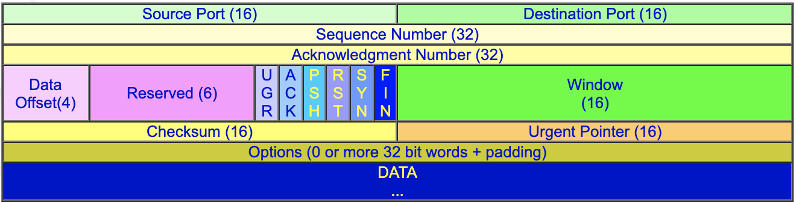
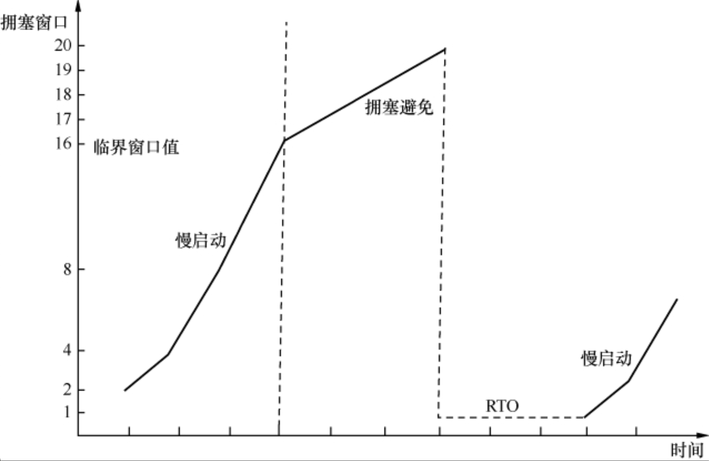
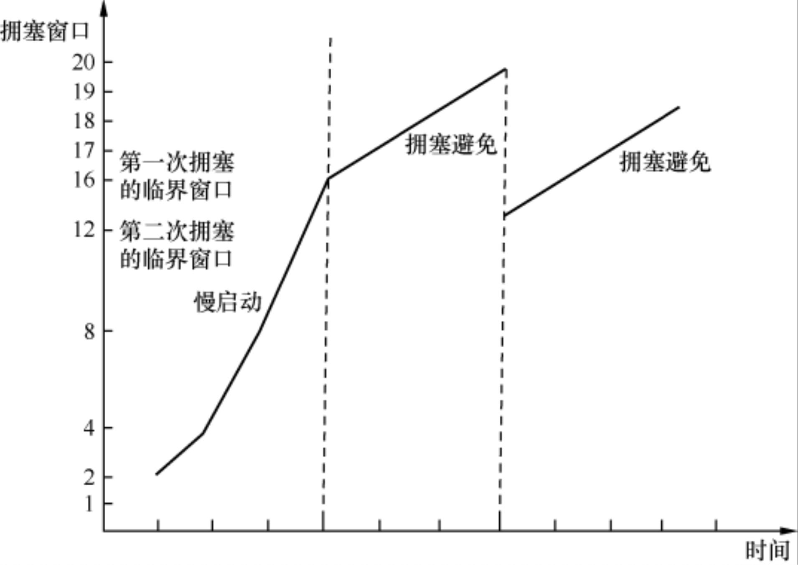

### frame

### MSL

报文最⼤生存时间,它是任何报文在网络上存在的最长时间

### 发送接收机制

接收端以确认信息(Acknowledgement) 回应发送端,肯定资料无误的到达,同时双方保留传送的封包记录,以作下一笔资料的确认依据

### 定时器的机制

在传送逾时后重新发送封包,以确保资料的完整性

### 三次握手

为了建立可靠的数据传输通道

- 客户端 SYN=1,seq=x
- 服务端 SYN=1,ACK=1,seq=y,ack=x+1
- 客户端 ACK=1,seq=x+1,ack=y+1

### 为什么是三次握手

2 个不够可靠.第一次连接的包延迟,于是发送第二个包.第二个包先到达然后关闭,第一个包再到达

### 四次挥手

保证等数据传输完再关闭连接,保证双方都达到关闭连接的条件才能断开

- 客户端 FIN=1,seq=u.并且自己处于 FIN-WAIT 状态
- 服务端 ACK=1,seq=v,ack=u+1
- 服务端 FIN=1,ACK=1,ack=u+1,seq=w
- 客户端 ACK=1,seq=u+1,ack=w+1.并进入 TIME-WAIT 状态,当等待 2MSL 后关闭连接

### 为什么等待 2MSL

ACk 报文可能会丢失,如果服务端没接收到 ACK 报文的话,会重新发送 FIN 报文,只有当客户端等待了 2MSL 都没有收到重新发送的 FIN 报文时,才表示服务端是正常接收到了 ACK 报文,这个时候客户端就能关闭了

### `滑动视窗(Sliding Window)`

多重发送和多重确认的技术.它允许发送端在接收到确认信息之前同时传送多个封包,因而能够更充份的利用网路频宽和加速资料传送速度

### 拥堵机制

- RTO 后 RFC 建议把拥塞窗口降到 1 个 MSS,而 RFC 5681 则认为应该是发生拥塞时没被确认的数据量的 1/2,但不能小于 2 个 MSS
- 少量丢包或者校验不对---每收到一个包就 Ack 一次期望的 Seq 号,以此提醒发送方重传.当发送方收到 3 个或以上重复确认(Dup Ack)时重传(`快速重传`)
- 快速恢复---如果在拥塞避免阶段发生了快速重传,传慢点就可.RFC 5681 建议临界窗口值应该设为发生拥塞时还没被确认的数据量的 1/2(但不能小于 2 个 MSS).然后将拥塞窗口设置为临界窗口值加 3 个 MSS
- 

### Westwood 算法

- 原因: 理想的算法应该是先推算出有多少包已经被送达接收方,从而更精确地估算发生拥塞时的带宽,最后再依据带宽来确定新的拥塞窗口(ACK)
- 原理: 当丢包很轻微时,由于能估算出当时拥塞并不严重,所以不会大幅度减小临界窗口值,传输速度也能得以保持.在经常发生非拥塞性丢包的环境中(比如无线网络)最能体现出其优势
- 追求比较理想的窗口

### Vegas 算法

- 原理 1: 通过监控网络状态来调整发包速度,从而实现真正的拥塞避免
- 原理 2: 当网络状况良好时,数据包的 RTT 比较稳定,这时候就可以增大拥塞窗口;当网络开始繁忙时,数据包开始排队,RTT 就会变大,这时候就需要减小拥塞窗口了
- 优点: 在拥塞真正发生之前,发送方已经能通过 RTT 预测到,并且通过减缓发送速度来避免丢包的发生
- 缺点: 当环境中所有发送方都使用时,总体传输情况是更稳定、更高效的,因为几乎没有丢包会发生.而当存在 Vegas 和其他算法时,性能可能最差,因为它最早探测到网络繁忙,然后主动降低了传输速度

### 拥堵的建议

- 没有拥塞时: 发送窗口越大,性能越好.所以在带宽没有限制的条件下,应该尽量增大接收窗口,比如启用 Scale Option
- 经常发生拥塞: 那限制发送窗口反而能提高性能,因为即便万分之一的重传对性能的影响都很大
- 超时重传对性能影响最大,因为它有一段时间 RTO 没有传输任何数据,而且拥塞窗口会被设成 1 个 MSS,所以要尽量避免超时重传
- 快速重传对性能影响小一些,因为它没有等待时间,而且拥塞窗口减小的幅度没那么大
- SACK 和 NewReno 有利于提高重传效率,提高传输性能
- Sack: 接收方在 Ack 号包的时候,顺便把收到的包号告诉发送方
- 丢包对极小文件的影响比大文件严重.因为读写一个小文件需要的包数很少,所以丢包时往往凑不满 3 个 Dup Ack,只能等待超时重传了.而大文件有较大可能触发快速重传

### 延迟确认

如果收到一个包之后暂时没什么数据要发给对方,那就延迟一段时间再确认.并没有直接提高性能,它只是减少了部分确认包,减轻了网络负担

### Nagle 算法

在发出去的数据还没有被确认之前,假如又有小数据生成,那就把小数据收集起来,凑满一个 MSS 或者等收到确认后再发送.没有直接提高性能,只是提高传输效率,减轻网络负担

### SYN 攻击

- net.core.netdev_max_backlog
- net.ipv4.tcp_max_syn_backlog---SYN_RCVD 状态连接的最大个数
- net.ipv4.tcp_abort_on_overflow---超出处理,直接回报 RST
- net.ipv4.tcp_syncookies = 1

### 命令

- netstat -n 显示套接字内容(ip)
