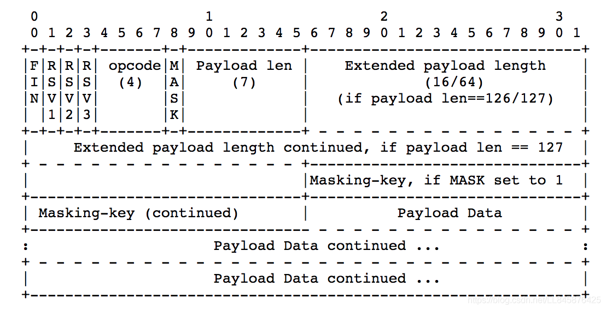

## [参考](https://blog.csdn.net/LL845876425/article/details/106393358)

## 概念

Web 浏览器和服务器之间的一种全双工通信协议。一旦 Web 客户端与服务器建立起连接，之后的全部数据通信都通过这个连接进行。可互相发送 JSON、XML、HTML 或图片等数据

## 对比 HTTP

### 相同

- 都是基于 TCP 的应用层协议
- 都使用 Request/Response 模型进行连接的建立
- 在连接的建立过程中对错误的处理方式相同，在这个阶段 WS 可能返回和 HTTP 相同的返回码

### 不同

- WS 使用 HTTP 来建立连接，但是定义了一系列新的 header 域，这些域在 HTTP 中并不会使用
- WS 的连接不能通过中间人来转发，它必须是一个直接连接
- WS 连接建立之后，通信双方都可以在任何时刻向另一方发送数据
- WS 连接建立之后，数据的传输使用帧来传递，不再需要 Request 消息
- WS 的数据帧有序

## 连接过程

### TCP 3 次握手

### ws 握手

- 请求方法必须为 GET，协议版本号必须大于 1.1
- Upgrade 字段必须包含且值为 websocket
- Connection 字段必须包含且值为 Upgrade
- Sec-WebSocket-Key 字段必须包含,记录着握手过程中必不可少的键值。
- Sec-WebSocket-Protocol 字段必须包含,记录着使用的子协议
- Origin(请求头): 用来指明请求的来源

### 响应

- 返回状态码为 101 Switching Protocols
- Upgrade 字段必须包含且值为 websocket
- Connection 字段必须包含且值为 Upgrade
- Sec-WebSocket-Accept 字段是由握手请求中的 Sec-WebSocket-Key 字段生成
- Sec-WebSocket-Protocol 字段必须包含,记录着使用的子协议

## frame

### FIN

指明 Frame 是否是一个 Message 的最后一帧

### Opcode

- 0x00 denotes a continuation frame
- 0x01 表示一个 text frame
- 0x02 表示一个 binary frame
- 0x03 ~~ 0x07 保留操作码
- 0x08 表示连接关闭
- 0x09 表示 ping (心跳检测相关)
- 0x0a 表示 pong (心跳检测相关)
- 0x0b ~~ 0x0f 保留操作码

### Payload len

### Payload data
